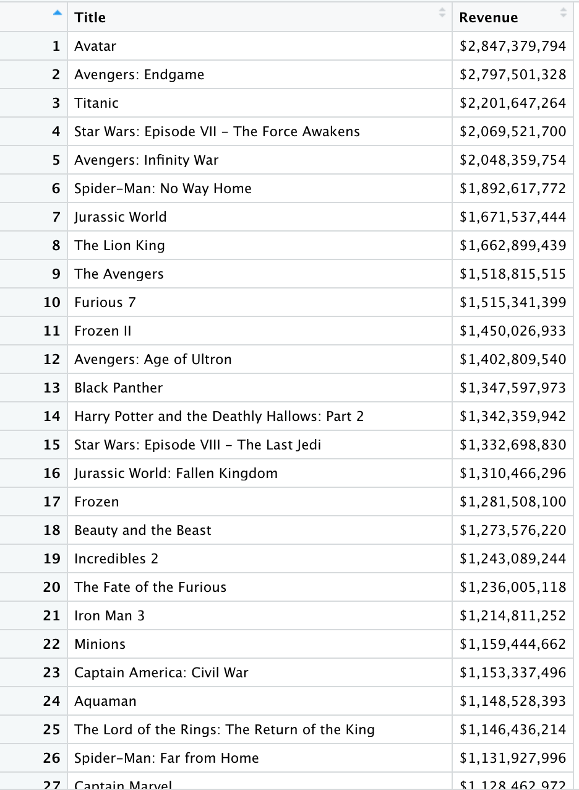

# Data Wrangling Group Project
> The purpose of this project was to display my expertise in RStudio. My group and I wanted to analyze how Movie ratings correlated with earnings overtime. Throughout this project we look at multiple different aspects that dive into that relationship. 

## Table of Contents
* [General Info](#general-information)
* [Technology](#technology)
* [Features](#features)
* [Screenshots](#screenshots)
* [Setup](#Setup)
* [Project Status](#project-status)
* [Acknowledgements](#acknowledgements)
* [Contact](#contact)

## General Information
- Group project completed in Data Wrangling at the University of Iowa
- All the data is from box office movie sales 

## Technology 
- RStudio (4.1)
- Github Desktop

## Features
- Correlation graph of Ratings vs Earnings
- Table of the data of movies and the revenue 

## Screenshots

## Setup
To correctly run this project one should have the latest version of RStudio downloaded. Once complete, download the 'Final Project.R' script and the 'imdb_top_1000.csv' to your local desktop. Set the working directory to your desktop in RStudio and begin running the code within the R script. 

## Project Status
Project is: _complete_
> This is a completed project that I did in the 2020-2021 school year in the Data Wrangling course at the University of Iowa 

## Acknowledgements
- My professor Mike Colbert is the one who assigned this project in the Data Wrangling course at the University of Iowa 
- Data: [Box Office Mojo](https://www.boxofficemojo.com/chart/ww_top_lifetime_gross/?ref_=bo_lnav_hm_shrt) and downloaded from [kaggle](https://www.kaggle.com/harshitshankhdhar/imdb-dataset-of-top-1000-movies-and-tv-shows).

## Contact
Created by [@katelynbonnett(https://www.linkedin.com/in/katelyn-bonnett-614a9b181/) - feel free to connect with me!
